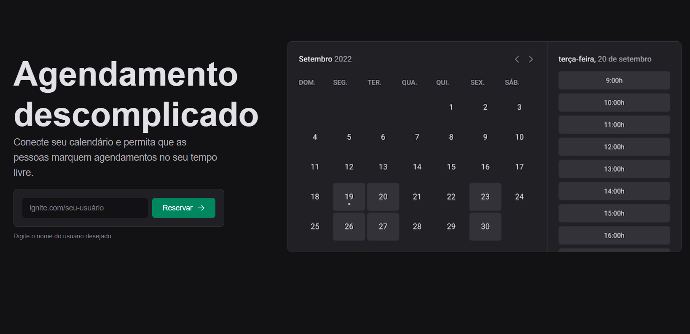

<p align="center">
  
</p>

<div align="center">
  
  
  

  
</div>

<h1 align="center">
  Ignite Call
</h1>

<br>

## 🧪 Technologies

This project was developed using the following technologies:

- [NextJS](https://nextjs.org/)
- [Stitches](https://stitches.dev/)
- [GoogleApis](https://cloud.google.com/apis?hl=pt-br)
- [Zod](https://www.npmjs.com/package/zod)
- [OwnComponentLibrary-NitoUI](https://github.com/nitoba/nito-design-system)
- [ReactHookForm](https://react-hook-form.com/)
- [PlanetScale](https://planetscale.com/)
- [Prisma](https://www.prisma.io/)

## 🚀 Getting started

Clone the project and access the folder.

```bash
git clone https://github.com/nitoba/ignite-call.git

cd ignite-call
```

Run this command to install the dependencies.

```bash
yarn install

yarn dev
```

## 🔖 Layout

You can view the project through the links below:

- [Figma](https://www.figma.com/community/file/1161274296921389678)
- [Live Preview](https://ignite-call-nito.vercel.app/)

## 📝 License

This project is licensed under the MIT License. See the [LICENSE](LICENSE) file
for details.

---

Made with 💜 by [Bruno Alves](https://nito-dev.vercel.app/) 👋
